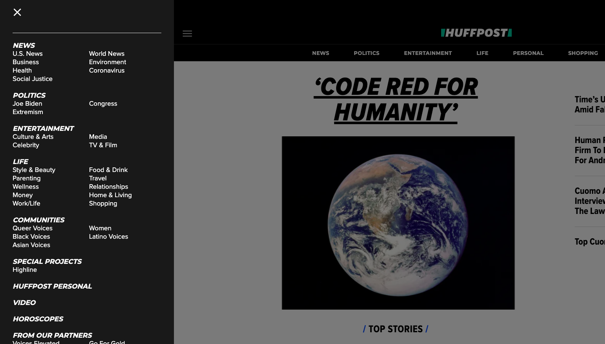
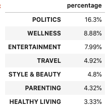
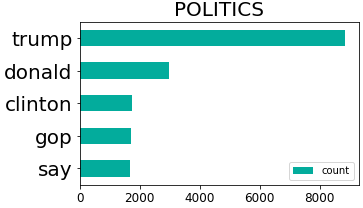
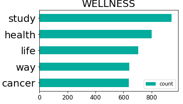
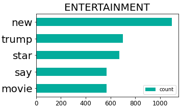
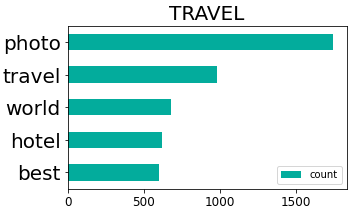

# Categorize and Summarize Huffington Post Articles with NLP

##### Authors: Will Cline, Jerry Hudspeth, John Carter Simmons

***
## Data
Our team leveraged 200k web articles from the Huffington Post.
* Each article contains a headline, a short description, and the article itself.

#### Sources:
https://www.kaggle.com/rmisra/news-category-dataset

***
## Goals
Through natural language processing models,
* We sought to classify the web articles into topic categories
* We sought to summarize the web articles.

***
## Modeling Process

***
## Visualizations
#### Topics with Most Articles

#### Most Common Words Found in Articles by Topic

## Next Steps
* Midterm election data may be collected and used on our same model.

## Contacts
#### Github:
* Will: https://github.com/willcline613/
* Jerry: https://github.com/jerryhudspeth
* John Carter: https://github.com/john-c-simmons/
#### Linkedin:
* Will: https://www.linkedin.com/in/will-cline-9924a1183/