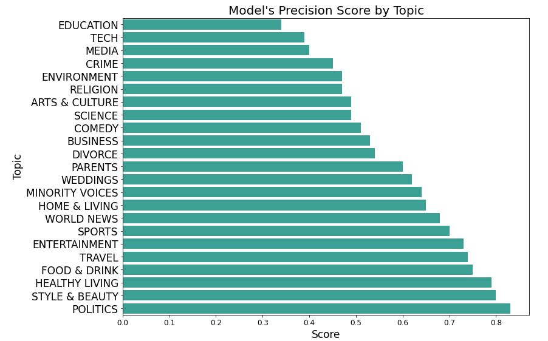

# Categorize and Summarize Huffington Post Articles with NLP

##### Authors: Will Cline, Jerry Hudspeth, John Carter Simmons

***
## Business Case for Categorizer
* You are are CEO of an online news publication;
* Articles are divided into excessively broad topics;
* You want to sort the entertainment category into subcategories(Music, TV etc.);
* Our AI can automate this task in a fraction of the time.

***
## Business Case for Summarizer
* Clickbait article headlines don’t represent articles’ content;
* Summary provides a more accurate way to judge whether it’s worth reading.
* Devout newspaper readers can become informed about the world in a fraction of the time.

***
## Data
* Our team scraped 130k web articles from the Huffington Post.
* Each observation contains a headline, a short description, and the article itself.

#### Sources:
https://www.kaggle.com/rmisra/news-category-dataset

***
## Goals
Through natural language processing models,
We sought to improve web article availability by providing a summary and classification system which classifies web articles by topic.

***
#### Topics with Most Articles

* Out of 41 possible topic categories on HuffingtonPost, these top 7 account for over 50% of the articles.

***
#### Most Common Words Found in Articles by Topic

#### Article Categories
* Heavily overlapping topics were combined.
* Highly subjective topics were dropped out of data.

***
## Final Recurrent Neural Network Model
After reducing number of article categories, the article text itself had to be converted into a format accepted by the model.
* Lemmatizing
* Label encoding
* Tokenizing and Padding
* Gensim Vectorization 
* Creating embedding matrix 

Our best performing RNN had a validation accuracy of .771

## Next Steps
* Deploy app to website
* Add input box for any web article URL for user friendly way to categorize and summarize any web article.
* Create software for scraping and summarizing all recent articles on a website.
* Create chrome plugin for TLDR button on reddit

## Contacts
#### Github:
* Will: https://github.com/willcline613/
* Jerry: https://github.com/jerryhudspeth
* John Carter: https://github.com/john-c-simmons/
#### Linkedin:
* Will: https://www.linkedin.com/in/willrcline

## Apendix:
Summarizer built using gpt2 and Hugging Face transformers library. Gpt2 trained on a dataset of 8 million web pages. Gpt2 trained with objective to predict the next word, given all of the previous words within some text.